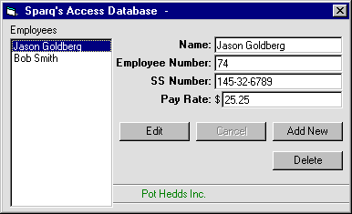



## HOW TO MANIPULATE AN ACCESS DATABASE \- Demo Pay Roll Program

### Description

To show how to ADD / EDIT / DELETE information

from an access Database. Fully Functional - Ready

to be used in your programs!!!
 
### More Info
 
must have MSDA0

             |
---                |---
**Submitted On**   |2000-07-25 11:09:46
**By**             |[Sparq](https://github.com/Planet-Source-Code/PSCIndex/blob/master/ByAuthor/sparq.md)
**Level**          |Intermediate
**User Rating**    |4.6 (37 globes from 8 users)
**Compatibility**  |VB 6\.0
**Category**       |[Databases/ Data Access/ DAO/ ADO](https://github.com/Planet-Source-Code/PSCIndex/blob/master/ByCategory/databases-data-access-dao-ado__1-6.md)
**World**          |[Visual Basic](https://github.com/Planet-Source-Code/PSCIndex/blob/master/ByWorld/visual-basic.md)
**Archive File**   |[CODE\_UPLOAD81397252000\.zip](https://github.com/Planet-Source-Code/sparq-how-to-manipulate-an-access-database-demo-pay-roll-program__1-10051/archive/master.zip)

